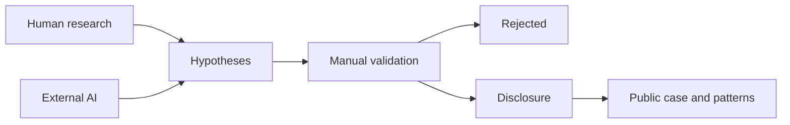

# VulnArc — Human–AI Collaborative Vulnerability Research

**From hypothesis to disclosure.**

VulnArc is a repo-first research notebook for disciplined, authorized vulnerability research. Markdown preserves reasoning; YAML preserves lifecycle and provenance; a small CLI removes repetitive work. **An AI finding is not a vulnerability**: every claim remains a hypothesis or candidate until reproducible evidence and human validation support it.

## Four areas

- **Research Cases** — sanitized records published only after coordinated disclosure.
- **Vulnerability Patterns** — reusable lessons extracted from validated cases.
- **Human × AI Experiments** — transparent comparisons without fabricated data.
- **Research Methodology** — attack-surface mapping, validation, rejection, and disclosure.



## Quick start

```bash
python3.12 -m venv .venv
. .venv/bin/activate
pip install -e '.[dev]'
vulnarc new hypothesis --target example-project --title 'Synthetic authorization question' \
  --origin human --security-boundary 'member -> project'
vulnarc validate
vulnarc stats
```

Use `--workspace /absolute/path/to/VulnArc-Research` for undisclosed work. The CLI never commits, pushes, publishes, or uploads.

## Commands

`validate`, `new hypothesis`, `new experiment`, `new case`, `list`, `status`, `stats`, and `compare`.

See [methodology](docs/methodology.md), [workflow](docs/research-workflow.md), and the [workspace model](docs/workspace-model.md).
